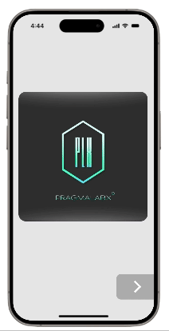

# react-page-screen


<div style="display: flex; align-items: top; gap: 15px; justify-content: space-between;">
  <div>
    A lightweight React component for managing screens, page transitions, and preloading. Effortlessly manage screen transitions and preloading with customizable effects, ideal for React applications.
    <br /><br />
    The motivation behind react-page-screen is to provide a lightweight solution for managing screens and transitions in mobile apps, particularly within WebViews. It simplifies page navigation, offers smooth transitions, and preloads content for faster, seamless user experiences.
---

## ✨ Features

✅ **Simple & Powerful API** – Manage screen transitions easily\
✅ **Preloading** – Load screens in the background\
✅ **Customizable Effects** – Add animations for smooth transitions\
✅ **Supports React 18, 19**  
</div>
 
   <br /><br />
  
  
</div>
  


---

## 📦 Installation


```sh
npm install react-page-screen
```

---

## 🚀 Usage

### Render initial screen

```tsx
import React from "react";
import PageScreen from "react-page-screen";


const App = () => (
  <PageScreen
    initScreenOptions={{
      Component: MainScreenComponent,
      screenName: "main-screen",                                    // optional
      props: { someProp1: "123", someProp2: { anyProp: true } },    // optional
    }}
    durationOptions={{                                              // optional
        fade: 200,
        slide: 300,
        blur: 150
    }}
    basePageClassName="my-awesome-app-screen"                       // optional
    BackButtonComponent={CustomBackButton}                          // optional
  />
);

export default App;
```

---

## 🔧 Props

| Prop                  | Type        | Description                                                        |
| --------------------- | ----------- | ------------------------------------------------------------------ |
| `initScreenOptions`   | `object`    | Initial screen configuration, including component, name, and props |
| `durationOptions`     | `object`    | Transition durations for effects (`fade`, `slide`, `blur`)         |
| `basePageClassName`   | `string`    | Base CSS class for the screen container                            |
| `BackButtonComponent` | `component` | Custom back button component                                       |

---


### Navigating Between Screens

`MainScreenComponent` automatically receives functions for navigation:

- `nextScreen(options)` – Navigates to the next screen.
- `backScreen()` – Navigates to the previous screen.
- `onBackScreen` – Callback when navigating back.
- `deleteScreens({screenNames: ['about-screen', 'gallery-screen']})` – Removes screens.
- `preloadScreen` – Preloads screens for faster transitions.

```tsx
const MainScreenComponent = ({ nextScreen,  someProp1, someProp2}) => {

    const [myProp, setMyProp] = useState(1)
    
    const onNextScreenButtonClick = () => {
        nextScreen({
            nextScreenOptions: {
                Component: AboutScreen,
                screenName: 'about-screen',             // optional
                effect: "slide",
                showBackButton: true,                   // optional
                className: "some-custom-class-name",    // optional
                onBackScreen: () => {setMyProp(2)},
                props: {                                // optional
                    myProp,
                    anyProp: '123'
                }
            },
        });
    };
    
    return (
        <div>
            <h1>Welcome Screen</h1>
            <button onClick={onNextScreenButtonClick}>Next</button>
            <button onClick={backScreen}>Back</button>
        </div>
    )
};
```


### Preload Screens


```tsx
const AboutScreen = ({ nextScreen, backScreen, onBackScreen, removeScreens, preloadScreen }) => {

    const galleryScreenPreloaded = preloadScreen({
        nextScreenOptions: {
            Component: BluredScreen,
            screenName: 'blured-screen',
            effect: 'fade',
            className: 'transparent-background',
            showBackButton: true,
            props: {
                f: 123,
            },
            currentScreenOptions: {
                onNext: {
                    effect: "blur",
                },
            },
        },
    })
    
    const onNextScreenButtonClick = () => {
        nextScreen(galleryScreenPreloaded);
    };

    const onUpdateSomeValueButtonClick = () => {
        screen4.updateProps({
                f: 456
            })
    };
    
    return (
        <div>
            <h1>About Screen</h1>
            <button onClick={onUpdateSomeValueButtonClick}>Update Some Value</button>
            <button onClick={onNextScreenButtonClick}>Next</button>
            <button onClick={backScreen}>Back</button>
        </div>
    )
};
```


---

## 🎨 Styling

Adding custom styles using the `basePageClassName` prop:

```css
.my-awesome-app-screen {
  background-color: #f4f4f4;
}
```

---

## 📜 License

This project is licensed under the **MIT License**.

---

## 📣 Contributing

Contributions are welcome! Feel free to submit issues or pull requests.

